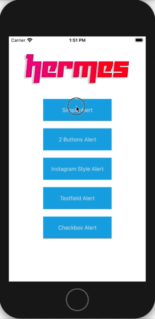

# HermesAlert
An elegant and lightweight alert for iOS, customizable and very easy to use.



# Requirements
iOS 12.0  
Xcode 12.0  
Swift 5.0

# Installation

## CocoaPods
CocoaPods is a dependency manager for Cocoa projects. For usage and installation instructions, visit their website. To integrate Hermes into your Xcode project using CocoaPods, specify it in your `Podfile`:

```ruby
pod 'HermesAlert'
```

## Swift Package Manager

The Swift Package Manager is a tool for managing the distribution of Swift code. It’s integrated with the Swift build system to automate the process of downloading, compiling and linking dependencies.

Once you have your Swift package set up, adding Hermes Alert as a dependency is as easy as adding it to the dependencies value of your Package.swift.

```Swift
dependencies: [
    .package(url: "https://github.com/alemarcon/HermesAlert.git", .upToNextMajor(from: "1.0.6"))
]
```

# Get start

Show an alert on Hermes is very easy and required just 1 line of code. In your view controller just type:

```Swift
Hermes(message: "Hi everybody!!").show()
```

and a cool alert will showed to you on your screen. Easy, right?

# HermesAlertType
You can easily change the appearance of your alert by changing the parameter
```Swift
alert: HermesAlertType
```
You can choose between different types and each of these will transform the appearance of the alert depending on the type selected.

For example, to show the default 2 buttons alert, you can simply set the **.twoButtons** alert type as is:

```Swift
Hermes(title: "2 Buttons", message: "Here you can choose OK or Cancel", alert: .twoButtons).show()
```

There are the alert type available:

- **simple**: this is the default alert. You don't need to set this type
- **twoButtons**: the alert with two customizable buttons
- **instagram**: the instagram style alert
- **checkbox**: an alert with a selectable checkbox
- **textfield**: an alert with a fillable textfield

# Customization
Customize your alert appearance specifing any single aspect of the alert also after it's initialization.

```Swift
// Customize alert title
alert.title("This is my title")
```

or, customize confirm button title

```Swift
// Customize alert confirm button title
alert.confirmButtonTitle("YEAH!")
```

or it's color

```Swift
// Customize alert confirm button color
alert.confirmButtonColor(.yellow)
```

# Manage alert button response
When user tap on alert button, by default it will be dismissed. If you need to do specific operation after that, you should implement **HermesAlertDelegate** that provide 2 methods responding to buttons of alerts. You will also have parameters that specify data inserted in alert (if you use Textbox alert for example).

If you don't need to manage alert response, you don't need to implement it's delegate.

## Confirm button

You can catch the confirm button action in **confirmButtonDidTapped** method, and you can check the options to know about user preference (like checkbox checked or not).

```Swift
func confirmButtonDidTapped(sender: UIViewController, with options: [HermesParam:Any]?) {
    if let options = options {
        if let checkbox = options[.checked] {
            print("User selected checkbox alert? \(checkbox)")
        }
    }
}
```

## Cancel button

Also for cancel button, you have a delegat method, **cancelButtonDidTapped** fired when user select the cancel button.

```Swift
func cancelButtonDidTapped(sender: UIViewController, with options: [HermesParam:Any]?)
```

If you are using alert without cancel button, **cancelButtonDidTapped** will never be fired.

## Customized button title
In case you have customized the title of the button, the confirmation and cancellation of the delegate will be activated anyway.


# Hermes origin
Why Hermes?? No i'm not a fashion addicted (as someone could think about) but Hermes, in ancient Greek religion and mythology is considered the herald of the gods. In myth, Hermes functioned as the emissary and messenger of the gods and here, Hermes would be the messenger of your app.

# Icons
Thanks for icons to:

Icons made by <a href="https://www.flaticon.com/authors/freepik" title="Freepik">Freepik</a> from <a href="https://www.flaticon.com/" title="Flaticon"> www.flaticon.com</a>

Icons made by <a href="https://www.flaticon.com/authors/kiranshastry" title="Kiranshastry">Kiranshastry</a> from <a href="https://www.flaticon.com/" title="Flaticon"> www.flaticon.com</a>

Icons made by <a href="https://www.flaticon.com/authors/smashicons" title="Smashicons">Smashicons</a> from <a href="https://www.flaticon.com/" title="Flaticon"> www.flaticon.com</a>
